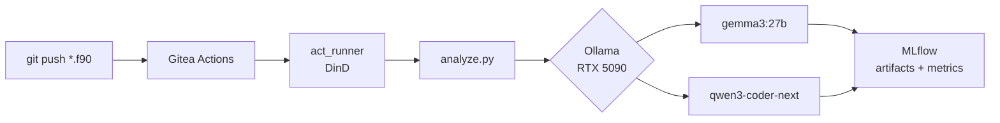

# fortran-modernizer


LLM-powered static analysis pipeline for legacy Fortran codebases. Runs entirely on self-hosted infrastructure — no external API calls, no cloud dependencies.

---

## The Problem

Legacy Fortran codebases represent a multi-billion dollar modernization problem across defense and IC agencies — aging simulations, navigation systems, and signal processing pipelines that no one wants to touch and fewer people understand. Most engineers building LLM-assisted modernization tools have encountered Fortran exactly once, in a blog post. This pipeline was built by someone who has maintained production Fortran in air-gapped environments: the static analysis targets patterns that actually matter — `GOTO`-driven control flow, `COMMON` block state, `IMPLICIT` typing, fixed-format source — not theoretical vulnerabilities invented by a model that read a textbook.

---

## How It Works

Every push containing a Fortran source file (`.f90`, `.f`, `.for`) triggers the analysis pipeline via Gitea Actions. The runner executes inside a Docker-in-Docker container so it inherits cluster-internal DNS and can reach services by their k3s service names — no IP hardcoding, no ingress required for internal traffic.



`analyze.py` discovers all Fortran files in the repository, runs each through both models sequentially, logs structured metrics and the full analysis report to MLflow, then unloads each model from GPU memory before loading the next. The MLflow experiment is named `Fortran_Modernization`.

---

## Stack

| Component | Purpose | Why |
|---|---|---|
| **Gitea** | Source control + CI orchestration | Self-hosted GitHub alternative; Actions syntax is compatible with existing GitHub Actions tooling |
| **act_runner (DinD)** | CI execution | Docker-in-Docker gives the runner cluster-internal DNS, enabling service discovery by k3s service name (`mlflow-svc`, `ollama`) without exposing them through ingress |
| **Ollama** | LLM inference server | Runs quantized models locally; supports model unloading between runs to stay within VRAM budget |
| **gemma3:27b** | Fast-pass analysis model | Low latency, strong general reasoning; used for initial vulnerability screening |
| **qwen3-coder-next** | Deep analysis model | Code-specialized; catches patterns Gemma misses at the cost of higher inference time |
| **MLflow** | Experiment tracking | Structured metric logging and artifact storage per run; self-hostable with no licensing friction |
| **k3s** | Container orchestration | Production-grade Kubernetes primitives (service discovery, DNS, persistent volumes) without the operational overhead of full k8s |
| **Traefik** | Ingress | Ships with k3s; handles TLS termination and routing for the MLflow UI |
| **CoreDNS** | Service discovery | Native to k3s; runner containers resolve `mlflow-svc` and `ollama` without any `/etc/hosts` manipulation |
| **RTX 5090** | GPU inference | 32GB VRAM accommodates 27B parameter models at reasonable quantization levels |

Every component is self-hosted. There are no calls to OpenAI, Anthropic, or any external inference API. The architecture was designed from the start to be deployable in an air-gapped environment where those options do not exist.

---

## Model Comparison

Benchmarked on the same Fortran sample set. Both models received the same prompt: analyze for security vulnerabilities and suggest a Python equivalent.

| Metric | gemma3:27b | qwen3-coder-next |
|---|---|---|
| Inference time | ~19.4s | ~111s |
| Vulnerability keywords flagged | 4 | 3 |
| Atomic write patterns | — | detected |
| File descriptor leaks | — | detected |
| Race conditions | — | detected |
| GOTO / COMMON / IMPLICIT detection | both | both |

**Strategic conclusion:** Gemma is the right choice for fast-pass screening across a large codebase — it will surface obvious issues in seconds. Qwen is the right choice for deep analysis on high-risk files: it runs 5x slower but catches concurrency and resource management issues that Gemma does not flag. A production workflow runs Gemma first, promotes flagged files to Qwen, and logs both sets of results to MLflow for comparison.

---

## MLflow Metrics

Every run logs the following to the `Fortran_Modernization` experiment:

| Metric | Description |
|---|---|
| `inference_time_sec` | Wall-clock time for the Ollama API call |
| `lines_of_code` | Non-empty, non-comment source lines |
| `vulnerability_count` | Keyword matches in model output (vulnerability, risk, overflow, unsafe, deprecated) |
| `has_goto` | 1 if any `GOTO` statement is present |
| `has_common_block` | 1 if any `COMMON` block is present |
| `has_implicit` | 1 if any `IMPLICIT` statement is present |
| `token_count` | `total_duration` from the Ollama response (nanoseconds) |

Params logged per run: `model`, `file`, `hardware` (RTX 5090).
Artifact logged per run: `report.txt` containing the full model output.

---

## Infrastructure

The pipeline runs on a bare-metal k3s cluster with GPU passthrough configured for the RTX 5090. Traefik handles ingress for the MLflow UI. CoreDNS provides service discovery — this is why the act_runner executes inside a DinD container rather than on the host directly; the runner needs to be inside the cluster network to resolve `mlflow-svc:5000` and `ollama:11434` by DNS name. k3s was chosen over Docker Compose because it provides real service discovery, persistent volume claims, and a reconciliation loop — the same primitives present in classified cluster environments — without requiring a full multi-node control plane.

---

## Design Philosophy

- **Air-gap first.** Every dependency is self-hosted. Deploying into a classified network means changing two environment variables, not re-architecting the pipeline. No model weights are pulled at runtime; they are pre-loaded into Ollama.
- **Domain expertise.** The static analysis heuristics — `GOTO` detection, `COMMON` block identification, `IMPLICIT` typing flags — reflect how Fortran actually fails in production. The sample files in `samples/` are representative of real legacy code patterns: numeric loop labels, fixed-format source, untyped `COMMON` block state, spaghetti error handling via `GOTO`.
- **Reproducible.** The pipeline is defined entirely as code: the Gitea workflow, the analysis script, and the k3s service topology. There is no manual step between `git push` and a logged MLflow run. A fresh cluster can reproduce any result from scratch.

---

## Fortran Sample Files

The files in `samples/` are not toy examples. Each one exercises a specific class of legacy pattern that appears regularly in operational codebases.

**`samples/array_ops.f90`** — Fixed-format FORTRAN 77 style with `IMPLICIT INTEGER (A-Z)` in effect across the entire translation unit. All three arrays and scalars live in named `COMMON` blocks (`/DATA/`, `/SCALARS/`), which means any routine that declares the same `COMMON` block gets read/write access to that memory with no interface contract and no compiler enforcement. Numeric loop labels and `CONTINUE` statements are the pre-`DO...END DO` loop idiom. This pattern is endemic in legacy simulation and ballistics code.

**`samples/io_handler.f`** — The canonical example of `GOTO`-as-control-flow. File open errors, read errors, end-of-file, and out-of-range values each branch to a numbered label; the actual logic path is reconstructed by tracing label jumps rather than reading top-to-bottom. Explicit integer file unit numbers (`10`, `20`) with no abstraction layer. This is exactly what decades-old data ingestion pipelines look like — the kind that read sensor or telemetry files and have never been refactored because they work and nobody wants to touch them.

**`samples/math_utils.f90`** — Fortran 90 module syntax: `MODULE`/`CONTAINS`/`END MODULE`, `INTENT(IN)` declarations, and the `RESULT` clause on functions. Included deliberately as a contrast case. A modernization tool that can only handle FORTRAN 77 fixed-format source is not useful in practice; real codebases are mixed. The overflow guards (`3.4E38` ceiling checks) reflect the kind of defensive arithmetic that gets added after a production incident.

---

## Getting Started

**Prerequisites:** k3s cluster with Ollama and MLflow deployed as in-cluster services, GPU passthrough configured, Gitea with act_runner registered as a DinD runner.

```bash
# Clone the repository into your Gitea instance
git clone http://<gitea-host>/<org>/fortran-modernizer

# Pull the models into Ollama before the first run
ollama pull gemma3:27b
ollama pull qwen3-coder-next

# Push any Fortran file to trigger the pipeline
git add samples/array_ops.f90
git commit -m "trigger analysis"
git push
```

The workflow at `.gitea/workflows/analyze.yml` fires automatically on any push touching a `.f90`, `.f`, or `.for` file. Configure the following in your Gitea Actions runner environment:

```
MLFLOW_URI=http://mlflow-svc:5000
OLLAMA_URI=http://ollama:11434/api/generate
```

Results appear in the MLflow UI under the `Fortran_Modernization` experiment.
